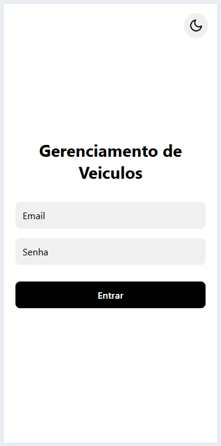
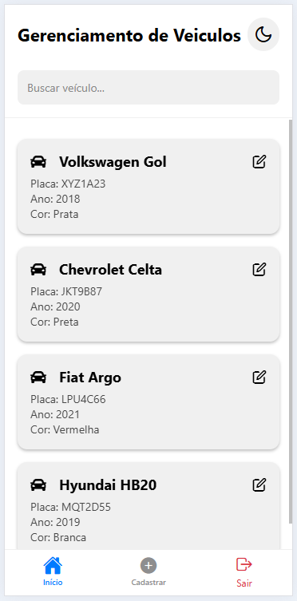
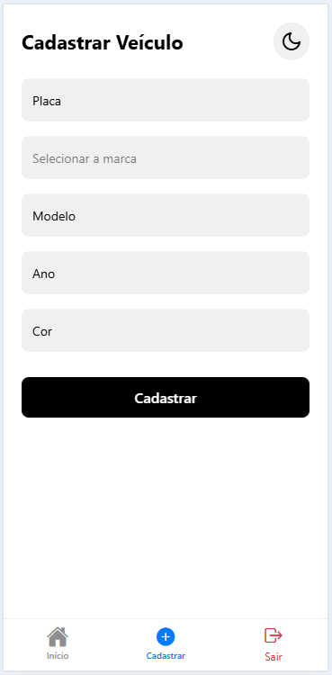
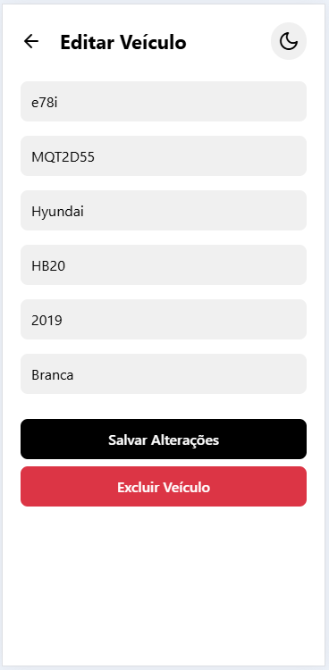
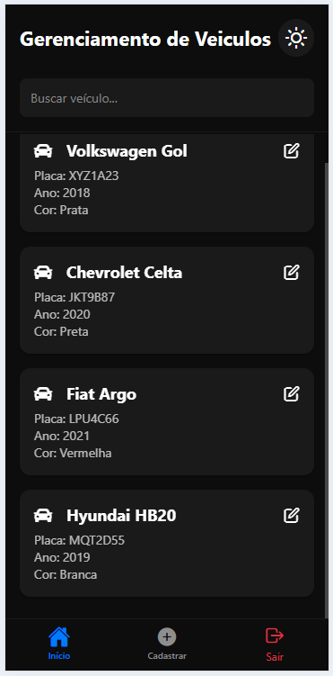

# Aplicativo de Gestão de Veículos

Este projeto é um aplicativo mobile e web desenvolvido em **React Native** com **Expo** e **React Navigation**, garantindo uma interface responsiva, intuitiva e funcional, permitindo o **cadastro, listagem, edição e exclusão** de veículos, e simulando uma API com JSON Server.

## Visão Geral

- **Tecnologias:** React Native, Expo, React Navigation, TypeScript, Axios, JSON Server,
- **Funcionalidades:** CRUD de veículos, tema claro/escuro, navegação por abas e modais, feedback visual via modais customizados, busca robusta, validação obrigatória, feedback visual universal,
- **Ambientes:** Suporte a web e mobile (Android/iOS).

## Arquitetura e Estrutura

- **React Navigation**: Navegação 100% baseada em Stack e Bottom Tabs,
- **Stack Navigator**: Gerencia telas de login, tabs principais e edição de veículos,
- **Bottom Tabs**: Listagem, cadastro e logout,
- **Modais customizados**: Feedback visual (sucesso, erro, confirmação) compatível com web e mobile,
- **Navegação protegida**: Telas principais protegidas por autenticação simulada,
- **Arquitetura limpa**: Implementação dos princípios SOLID,
- **API:** Axios configurado para ambiente web/mobile, consumindo um JSON Server local.

## Estrutura de Pastas (resumida)

```bash
/vehicle-manager-app
├── App.tsx                # Define navegação React Navigation,
├── app/                   # Contextos e telas,
│   ├── contexts/
│   │   └── ThemeContext.tsx
│   ├── login.tsx
│   ├── Home.tsx
│   ├── Register.tsx
│   └── EditVehicle.tsx
├── hooks/                 # Hooks customizados,
├── components/            # Componentes reutilizáveis
├── constants/             # Cores, marcas, estilos
├── services/              # API (axios)
├── types/                 # Tipos TypeScript
├── db.json                # Base de dados fake (JSON Server)
```

## UX/UI e Funcionalidades

- **CRUD completo:** Cadastro, listagem, edição e exclusão de veículos,
- **Busca robusta:** Ignora acentos, espaços, maiúsculas/minúsculas, busca por múltiplos campos,
- **Validação obrigatória:** Cadastro e edição exigem todos os campos preenchidos, com feedback visual via modal customizado,
- **Validação de placa:** Aceita 3 formatos (ABC1D23, ABC1234, ABC-1234), e sempre salva em maiúsculo,
- **Validação de ano:** Apenas 4 dígitos (ex: 2025),
- **Validação de e-mail:** No login, exige formato de e-mail válido,
- **Feedback visual:** Modais customizados para sucesso, erro e confirmação, compatíveis com web e mobile,
- **Tema global:** Alternância clara/escura em todo o app, inclusive na tab bar,
- **Acessibilidade:** Uso de SafeAreaView, contraste de cores, botões grandes e textos legíveis.

## Dependências Principais

- **@react-navigation/native**: Navegação principal,
- **@react-navigation/stack**: Navegação em pilha (Stack Navigator),
- **@react-navigation/bottom-tabs**: Navegação por abas,
- **axios**: Consumo de API REST,
- **@react-native-async-storage/async-storage**: Persistência do tema,
- **JSON Server**: Backend simulado para CRUD,
- **React Native/Expo**: Base do app.

## Instruções de Uso

1. **Clone o repositório:**

   ```bash
   git clone git@github.com:mhbordalo/vehicle-manager-app.git
   cd vehicle-manager-app
   ```

2. **Instale as dependências:**

   ```bash
   npm install
   ```

3. **Inicie o JSON Server:**

   ```bash
   json-server --watch db.json --port 3001
   ```

4. **Execute o app:**

   ```bash
   npx expo start -c
   ```

   - Para web:
      - pressione "w" no terminal,
      - "F12" no navegador,
      - Ctrl+Shift+M para ativar emulação de dispositivo
   - Para mobile: use o app Expo Go ou emulador

## Telas

1. **Tela de login:**

   

2. **Tela de listagem:**

   

3. **Tela de cadastro:**

   

4. **Tela de edição e exclusão:**

   

5. **Tela em dark mode:**

   

## Schema JSON Server

```bash
{
  "vehicles": [
    {
      "id": "b12f",
      "placa": "XYZ1A23",
      "marca": "Volkswagen",
      "modelo": "Gol",
      "ano": "2018",
      "cor": "Prata"
    },
    {
      "id": "c34g",
      "placa": "JKT9B87",
      "marca": "Chevrolet",
      "modelo": "Celta",
      "ano": "2020",
      "cor": "Preta"
    },
    {
      "id": "d56h",
      "placa": "LPU4C66",
      "marca": "Fiat",
      "modelo": "Argo",
      "ano": "2021",
      "cor": "Vermelha"
    },
    {
      "id": "e78i",
      "placa": "MQT2D55",
      "marca": "Hyundai",
      "modelo": "HB20",
      "ano": "2019",
      "cor": "Branca"
    }
  ]
}
```

---

> Desenvolvido para PosTech FIAP - Full Stack Development - Mobile
